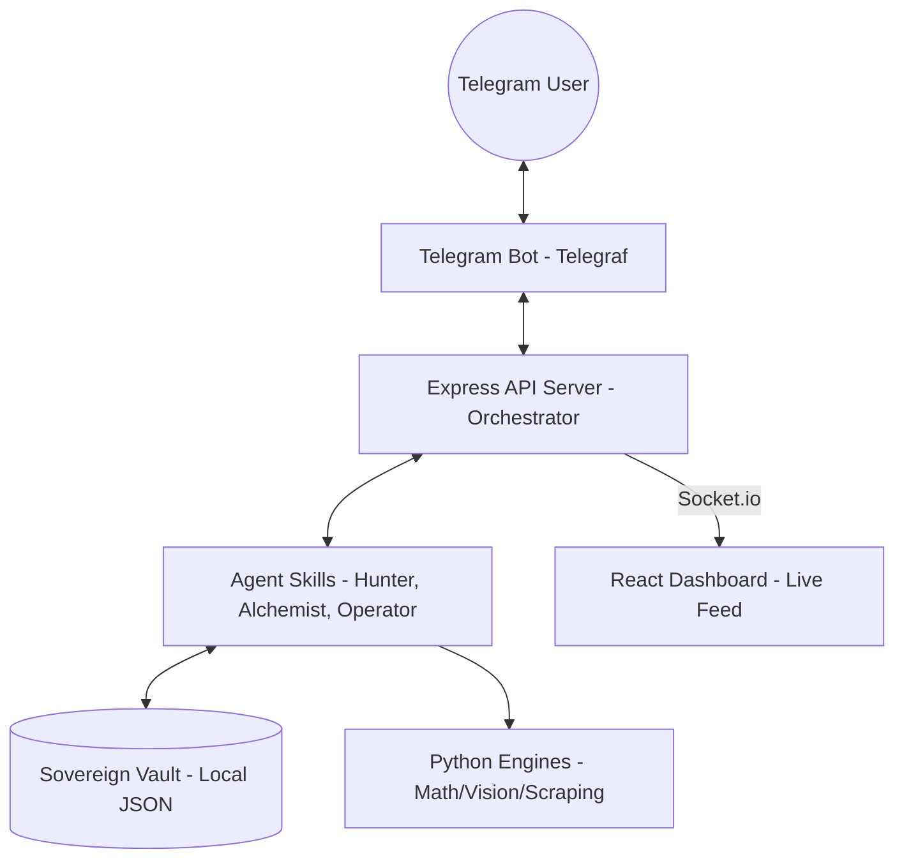

# CraveMap – Full 10‑Slide Pitch Deck

---

## Slide 1 – Problem Statement

**Why we selected this theme (On‑device, Productivity, GenAI Research):**
We chose the GenAI + Productivity theme because food decisions are one of the most repetitive, unoptimized daily tasks. People waste 20–30 minutes every day deciding what to eat — and the answer is already hidden in their own digital footprint.

**What problem are we solving:**
"Digital Food Hoarding" — users save hundreds of restaurant reels, Instagram posts, and chat recommendations but never revisit them. ~50% of saved spots are never visited because they're buried in noise across 5+ apps.

**Who faces it (Persona):**
Urban millennials and Gen‑Z foodies (ages 18–35) who actively consume food content on social media, eat out 3–5 times a week, and frequently struggle with group dining decisions.

**Why is it important:**
Food is the #1 discretionary spending category. Bad decisions lead to wasted money, wasted time, and repeated "default" choices. No existing tool treats food memory as an intelligent, personal, evolving system.

---

## Slide 2 – Current Solution & Gaps

**Existing solutions:**
- **Google Maps / Zomato / Yelp** — search engines that show ratings and reviews.
- **Instagram Saved Posts** — unstructured dump with no filtering or intelligence.
- **WhatsApp/Telegram chats** — recommendations from friends, lost in scroll history.

**What's missing / broken:**
- Zero personalization — these tools don't know your craving history or past visits.
- No proactive suggestions — you must manually search every time.
- Group dining is painful — no tool resolves conflicting preferences (vegan + spicy + budget).
- No memory — every session starts from scratch; the app forgets you exist.

**Opportunity:**
Build an autonomous agent that turns scattered food signals into a proactive, personalized, privacy‑first food intelligence system — one that remembers, learns, and acts on your behalf.

---

## Slide 3 – Your Solutions

**What we built:**
CraveMap — a Sovereign Food Intelligence Agent powered by a multi‑agent architecture on OpenClaw + Groq (Llama 3). It ingests your social food signals, builds a personal taste profile, and proactively recommends the right meal at the right time.

**Core Ideas:**
1. **Craving Cycle Engine** — tracks when you last ate each cuisine and detects overdue cravings (e.g., "You haven't had biryani in 10 days").
2. **Sovereign Data Vault** — all food memory stored locally in per‑user JSON files. No cloud. You own your data.
3. **Multi‑Agent Orchestration** — three specialized agents (Social Hunter, Taste Alchemist, Lifestyle Operator) collaborate autonomously.

**Key Features:**
- AI extraction from Telegram chats, Instagram reels, and food photos.
- Weather‑aware + time‑of‑day proactive suggestions.
- Group Consensus Engine — mathematically resolves dining conflicts across multiple users.
- Photo‑based visit verification via Google Gemini Vision.
- Real‑time React dashboard with live agent thought streams via WebSocket.

---

## Slide 4 – Demo / Product Walkthrough ⭐ (Most Important Slide)

**Screen / Flow:**
1. User opens Telegram → sends `/start` → 4‑step onboarding captures diet, cuisines, spice level, eating style.
2. User pastes a food reel link or types "Check out Rameshwaram Cafe in Brookfield" → **Social Hunter** extracts structured metadata in real time.
3. Dashboard "OpenClaw Operations" feed lights up — showing live agent thoughts: `EXTRACTION → CYCLE_CHECK → WEATHER_CHECK → SYNC`.
4. User types `/discover Koramangala` → receives top 5 ranked restaurants + a wildcard pick → taps "Save to Vault."
5. User uploads a food photo → **Gemini Vision** verifies the visit and resets the craving cycle.

**How User Interacts:**
- Primary interface: **Telegram Bot** (inline keyboards, buttons, natural language).
- Secondary interface: **React Dashboard** (real‑time analytics, craving visualizations, agent feed).

**Key Moments:**
- 🔥 A saved Instagram reel instantly becomes structured data in the vault.
- 🌧️ Rain detected → Lifestyle Operator autonomously pushes "Rainy Day Ramen" suggestion.
- 👥 Group Consensus resolves 4 people's conflicting preferences into one 92% harmony pick.

---

## Slide 5 – Demo / Product Walkthrough (Continued)

**Group Consensus Flow:**
1. Host sends `/consensus` → Lobby opens → Friends join via Telegram.
2. Host clicks "Lock It In" → Backend collects all peer taste vectors.
3. Python Social Brain runs weighted voting algorithm → returns best match with reasoning.
4. Result: "🏆 Fusion Biryani (Indiranagar) — satisfies Explorer + Budget‑conscious + Italian lover."
5. Any member can Veto → selects reason (Too Expensive / Too Far / Not in Mood) → system re‑weights and recalculates.

**Vault Search Flow:**
- User types: "South Indian under 300 rupees"
- Bot parses query → filters vault → returns matching spots with prices.

**Safety Net (Simulation Mode):**
- If any API key is missing or Wi‑Fi drops, agents seamlessly switch to rich simulation data.
- Flawless demo guaranteed under any condition.

---

## Slide 6 – Impact & Use Cases

**Real‑life Scenarios:**

1. **The Friday Night Dilemma** — A group of 4 friends can't agree on dinner. CraveMap's Consensus Engine analyses everyone's taste vectors and finds "92% harmony" at a fusion restaurant — decision made in 30 seconds instead of 30 minutes.

2. **The Solo Explorer** — A user discovers a reel about a hidden café. They paste the link in Telegram; Social Hunter extracts and saves it. Two weeks later, when they're near that area, the Lifestyle Operator reminds them.

3. **The Rainy Day Nudge** — Weather API detects rain at 6 PM. Without any user action, the agent pushes a "Cozy Ramen Night" suggestion based on past preferences and craving cycles.

4. **The Health‑Conscious Tracker** — A user notices via the dashboard that they've eaten only pizza for the last 5 meals. The Variety Enforcer flags it and suggests cuisine rotation — automatically penalising pizza for the next 5 days.

**Scale Potential:**
- Expandable to any city (currently optimized for Bangalore via Nominatim geocoding).
- Multi‑platform: Telegram today → WhatsApp, Discord, and standalone app tomorrow.
- Enterprise potential: Corporate cafeterias, food delivery partnerships, restaurant recommendation APIs.

---

## Slide 7 – Tech & Architecture (Detailed)

---

### A. Tech Stack (Core Infrastructure)

| Layer | Technology | Key Dependencies | Role |
|-------|-----------|------------------|------|
| **Frontend** | **React 19** + **Vite** | `framer-motion`, `recharts`, `lucide-react` | Real-time premium dashboard with craving visualizations |
| **Backend** | **Express.js** (Node 22) | `socket.io`, `axios`, `dotenv` | Central orchestrator for all agent skills and API routes |
| **Bot** | **Telegraf** | Telegram Bot API | Primary user interface for messaging and interaction |
| **Math Engine** | **Python 3** | `numpy`, `scipy` | Complex weighted voting and consensus math (`social_brain.py`) |
| **AI Layer** | **Multi-Model SDKs** | `groq-sdk`, `google-generativeai` | Language processing, vision analysis, and web search |
| **Storage** | **Sovereign Vault** | Local JSON + AES-256-CBC | Privacy-first local data storage (`crypto.js`) |

---

### B. AI Usage (Models, APIs & Frameworks)

- **Llama 3.3 70B (via Groq):** The "Brain." Handles natural language extraction from chats, restaurant metadata enrichment, and persona generation. We use Groq's LPU hardware for sub-second inference speed.
- **Google Gemini Vision API:** The "Eyes." Powers the `visit_verifier.py` engine to identify restaurants from user-uploaded photos of food, menus, or signage.
- **Tavily Search API:** The "Librarian." Provides real-time web search capabilities for cold-start recommendations and deep-enrichment of restaurant metadata.
- **Nominatim & Overpass (OpenStreetMap):** The "GPS." Used for geocoding and scouting a 3km radius around the user for potential food discoveries.
- **OpenWeather API:** The "Sensor." Supplies ambient weather data to trigger contextual recommendations (e.g., Rainy Day Ramen).

---

### C. System Flow (Simple Visualization)

**Workflow:**
1. **Input:** User sends a Reel link to the Bot.
2. **Process:** Bot forwards to Server → Social Hunter (Skill) calls Python (Scraper) & Groq (LLM).
3. **Storage:** Structured metadata is saved to the private Sovereign Vault.
4. **Output:** Dashboard updates live via WebSockets; Bot confirms save to user.

---

## Slide 8 – Differentiation

**Why CraveMap stands out:**

Unlike Zomato, Yelp, or Google Maps — which are passive search tools — CraveMap is an **autonomous agent** that watches, learns, and acts. It doesn't wait for a query; it proactively nudges you based on weather, time, craving cycles, and group dynamics.

**MOAT 1 — Sovereign Data Architecture:**
Your food memory lives **only on your device** in local JSON vaults. No cloud database, no data selling, no ad targeting. In an era of data privacy concerns, CraveMap is the only food platform where the user truly owns their behavioral data. This builds irreplaceable trust and user lock‑in.

**MOAT 2 — Behavioral Craving Graph:**
Every interaction builds a deeper "Craving Cycle" model unique to each user — tracking cuisine frequency, visit patterns, veto history, and group preferences. The longer you use CraveMap, the smarter it gets. Competitors would need months of personal data to replicate this — and they can't, because they don't store it locally.

---

## Slide 9 – Demo Link

**GitHub Repo:**
🔗 https://github.com/lpreetam494-cell/CraveMap

**Demo Link:**
🤖 Telegram Bot: Search for the bot using your `TELEGRAM_BOT_TOKEN` in the Telegram app.
🎨 Dashboard: `http://localhost:5173` (React + Vite dev server)
💻 API Server: `http://localhost:5001` (Express backend)

**Document Submitted:**
📄 `IMPLEMENTATION_WALKTHROUGH.md` — 786‑line comprehensive technical walkthrough covering all 12 parts of the system architecture, agent workflows, data flows, and API integrations.

---

## Slide 10 – Brownie Slide 🍫

**What sets us apart beyond the core product:**

- **Hackathon Safety Net** — If stage Wi‑Fi drops or any API key is missing, agents seamlessly switch to rich simulation mode. We guarantee a flawless demo under any condition.

- **Multi‑Agent Transparency** — The dashboard shows live agent "thoughts" in real time (EXTRACTION, CYCLE_CHECK, WEATHER_CHECK). Judges and users can see exactly what the AI is doing and why — full explainability, zero black‑box.

- **Built for Real Users, Not Just Demos** — The Telegram bot is production‑ready with onboarding, vault export (`/export_vault`), privacy toggle (`/privacy_mode`), and nuclear data wipe (`/wipe_memory`). This isn't a mockup; it's a usable product.

- **Mathematical Group Consensus** — Not just voting. We use a Python‑powered weighted algorithm that factors in cuisine expertise, peer trust, mood profiles, and veto history to find the mathematically optimal restaurant for any group.
